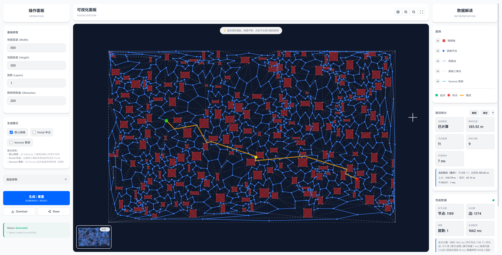

# RoadNet Visualizer

Multi-layer road network generator and visualizer built with Vite, Three.js, and Web Workers. It supports path optimization (smoothing/orthogonalization), multi-layer navigation, interactive controls, export/share, and theming.

[中文文档 | Chinese README](./README.zh-CN.md)

[](https://deepwiki.com/Duri686/RoadNetVisualizer)


## Live Demo

- GitHub Pages: [RoadNet Visualizer Demo](https://duri686.github.io/RoadNetVisualizer/)
- Desktop and mobile supported. Latest Chrome/Edge recommended.

## Table of Contents

- [Features](#features)
- [Preview](#preview)
- [Getting Started](#getting-started)
  - [Requirements](#requirements)
  - [Local Development](#local-development)
  - [Build & Deploy](#build--deploy)
- [Core Concepts & Architecture](#core-concepts--architecture)
- [Config Examples](#config-examples)
- [Roadmap](#roadmap)
- [Contributing](#contributing)
- [FAQ](#faq)
- [License](#license)
- [Acknowledgments](#acknowledgments)

## Features

- Multi-layer road networks  
  Centroid network, portal midpoints, Voronoi skeleton (experimental)
- Path planning and optimization  
  A* pathfinding; smoothing and orthogonalization; timing metrics
- Interaction and navigation  
  3D Camera controls (Orbit), node picking, layer toggles, canvas navigation controls
- Export and sharing  
  One-click export and share
- Mobile friendly  
  Better touch experience
- Performance & observability  
  Index building, render init/total time, data size metrics
- Themes & styles  
  Dark/monochrome themes, componentized style system
- Docs & help  
  DeepWiki integration for quick knowledge lookup

## Preview





## Getting Started

### Requirements

- Node.js >= 20
- Package manager: Yarn (via Corepack)
- Browser: modern Chrome/Edge

### Local Development

```bash
corepack enable
yarn install --immutable

# Start dev server
yarn dev

# Build
yarn build

# Preview (after build)
yarn preview
```

### Build & Deploy

- GitHub Pages workflow: `.github/workflows/deploy.yml`
- Push to `main` triggers build and deploy of `dist/` to GitHub Pages
- Vite `base: './'` is configured for sub-path and Pages compatibility

## Core Concepts & Architecture

- Multi-layer network building  
  - Centroid network: skeleton nodes from regions/grids  
  - Portal midpoints: cross-partition connections  
  - Voronoi skeleton (experimental): alternative representation using Voronoi edges/points
- Path planning & optimization  
  - Pathfinding: A*  
  - Optimization: smoothing, orthogonalization for straighter, smoother lines  
  - Metrics: timing breakdown for pathfinding and optimization
- Rendering & interaction  
  - Rendering: Three.js (WebGL)  
  - Interaction: 3D Orbit controls, node picking, layer toggles  
  - Animation: moving ball along path
- Concurrency & performance  
  - Web Workers: index/compute off main thread  
  - Observability: index duration, render init, total time, data size

> Project structure reference:

```text
src/
├── core/                # rendering core (render/view/layers/interaction/config + workers)
├── core/interaction/    # interaction modules (events/pipeline/animation)
├── utils/               # utilities (navigation/geometry/path/index/export/share/state ...)
│   └── navigation/      # navigation submodules (centroid/portal/voronoi/partition ...)
├── components/          # UI components (forms, progress, layer control)
├── css/                 # styles & themes (base/reset/tokens/utilities/layout/buttons/forms/...)
└── main.js              # app entry
```

## Config Examples

- Deploy: `vite.config.js` uses `base: './'`  
- Build: `build.outDir = dist`, `build.sourcemap = true`  
- Dev: `server.port = 3000`, `server.open = true`  
- Worker: `worker.format = 'es'`

> If you plan to expose runtime/algorithm configs (e.g., grid size, weights, sampling density, smoothing factor), export them under `src/core/config/` and document here.

## Roadmap

- [ ] More data formats for import/export (e.g., GeoJSON)
- [ ] Richer weights/constraints (lanes/turns/restrictions/cost functions)
- [ ] Enhanced optimization strategies (multi-objective/segmented)
- [ ] Performance profiling panel and metric visualization
- [ ] Unit tests and E2E coverage
- [ ] i18n and accessibility (a11y)
- [ ] More themes and visualization styles

## Contributing

- Branch model: feature/xxx -> PR to `main`
- Conventions: Node 20 + Yarn, ESM, pass ESLint/Prettier
- Steps:
  1. Fork and create a feature branch
  2. `corepack enable && yarn install --immutable`
  3. `yarn dev` and ensure build passes
  4. Open a PR with motivation and screenshots/diffs

> Issues and suggestions are welcome.

## FAQ

- Blank page on Pages?  
  `base: './'` is set. If still broken, clear cache or verify Pages settings (branch/path).
- Node version?  
  Node >= 20. Use official LTS and enable Yarn via Corepack.
- Local preview URL?  
  `http://localhost:3000/` (Vite dev server).
- Performance unstable?  
  Use hardware-accelerated browsers with WebGL; for large data, reduce sampling or load in batches.
- DeepWiki not showing?  
  Check network or use the provided documentation link directly.

## License

Licensed under the PolyForm Noncommercial License 1.0.0. See [LICENSE](./LICENSE) for details. Commercial use is prohibited. For commercial licensing, please open an Issue to contact us.

## Acknowledgments

- [Three.js](https://threejs.org/)
- [d3-delaunay](https://github.com/d3/d3-delaunay)
- [Turf.js](https://turfjs.org/)
- Vite & GitHub Actions

---
Repository: [Duri686/RoadNetVisualizer](https://github.com/Duri686/RoadNetVisualizer)
