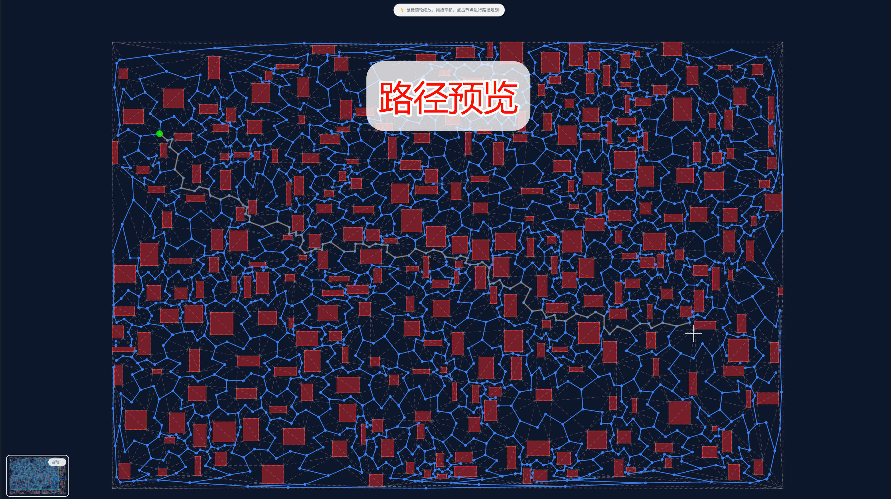

# RoadNet Visualizer

**High-Performance 3D Road Network Visualization & Navigation Simulation Platform**

RoadNet Visualizer is a cutting-edge 3D visualization tool designed for complex multi-layer structures. It leverages **Hierarchical Pathfinding** and **Web Workers** to deliver smooth, real-time navigation simulations for large-scale road networks, including multi-story buildings and transportation hubs.

[中文文档 | Chinese README](./README.zh-CN.md)

[](https://deepwiki.com/Duri686/RoadNetVisualizer)


## Live Demo

- GitHub Pages: [RoadNet Visualizer Demo](https://duri686.github.io/RoadNetVisualizer/)
- Desktop and mobile supported. Latest Chrome/Edge recommended.

## Table of Contents

- [Features](#features)
- [Use Cases](#use-cases)
- [Key Advantages](#key-advantages)
- [Preview](#preview)
- [Getting Started](#getting-started)
- [Core Architecture](#core-architecture)
- [Roadmap](#roadmap)
- [Contributing](#contributing)
- [FAQ](#faq)
- [License](#license)

## Features

- **Multi-Layer Visualization**: Seamlessly display multi-story road networks, accurately rendering vertical connections like stairs and elevators.
- **Intelligent Pathfinding**: Built-in **Hierarchical A*** algorithm supports long-distance cross-floor navigation, dynamic obstacle avoidance, and smooth path animation.
- **Real-Time Interaction**: Interactive 3D controls for node picking, layer toggling, free-roaming camera, and instant path metrics.
- **High-Quality Rendering**: Custom Three.js engine featuring "Glass Night" theme, dynamic lighting, post-processing, and particle effects.

## Use Cases

- **Indoor Navigation Simulation**: Navigation demos for complex multi-story venues like malls, airports, and hospitals.
- **Game AI Development**: Visual debugging for NavMesh/Waypoints and AI movement logic.
- **Emergency Evacuation**: Simulating evacuation routes in high-rise buildings to identify bottlenecks.
- **Robotics Path Planning**: Validating algorithms for Autonomous Mobile Robots (AMR) in multi-layered environments.

## Key Advantages

- **High Performance**: **Web Workers** offload heavy computations (hierarchy building, layer processing), ensuring **60FPS** performance even with large datasets.
- **Efficient Algorithms**: **Hierarchical Pathfinding** (Zone/Portal search + Local A*) significantly outperforms traditional methods on large maps.
- **Modern Aesthetics**: Premium "Glass Night" UI with glassmorphism effects and curated color palettes.
- **Extensibility**: Modular architecture (Managers, Renderers, Systems) allows easy integration of new layers or custom algorithms.

## Preview





## Getting Started

### Requirements

- Node.js >= 20
- Package manager: Yarn (via Corepack)
- Browser: modern Chrome/Edge

### Local Development

```bash
corepack enable
yarn install --immutable

# Start dev server
yarn dev

# Build
yarn build

# Preview (after build)
yarn preview
```

### Build & Deploy

- GitHub Pages workflow: `.github/workflows/deploy.yml`
- Push to `main` triggers build and deploy of `dist/` to GitHub Pages.

## Core Architecture

- **Tech Stack**:
  - **Core**: JavaScript (ES6+)
  - **Rendering**: Three.js (Modularized)
  - **Compute**: Web Workers (Parallel processing)
  - **Algorithms**: Hierarchical A*, Voronoi, Spatial Indexing
  - **Styling**: CSS3 (Variables, Glassmorphism)

- **Structure**:
  ```text
  src/
  ├── core/                # Rendering engine & Workers
  ├── managers/            # App logic (Events, Generation, UI)
  ├── renderer3d/          # Three.js renderers & systems
  ├── utils/               # Algorithms (Pathfinding, Geometry)
  ├── components/          # UI Components
  └── main.js              # Entry point
  ```

## Roadmap

- [ ] Import/Export support for GeoJSON
- [ ] Advanced constraints (lanes, turn restrictions, cost functions)
- [ ] Multi-objective path optimization
- [ ] Performance profiling dashboard
- [ ] Unit & E2E tests
- [ ] Internationalization (i18n) & Accessibility (a11y)

## Contributing

1. Fork and create a feature branch.
2. `yarn install` and `yarn dev`.
3. Submit a PR with screenshots/diffs.

## FAQ

- **Blank page on Pages?** Check `base: './'` in vite config.
- **Node version?** Node >= 20 required.
- **Performance?** Use hardware acceleration; reduce sampling for massive datasets.

## License

Licensed under the **PolyForm Noncommercial License 1.0.0**. See [LICENSE](./LICENSE).
**Commercial use is prohibited.** Contact us for commercial licensing.

## Acknowledgments

- [Three.js](https://threejs.org/)
- [d3-delaunay](https://github.com/d3/d3-delaunay)
- [Turf.js](https://turfjs.org/)
- Vite & GitHub Actions

---
Repository: [Duri686/RoadNetVisualizer](https://github.com/Duri686/RoadNetVisualizer)
