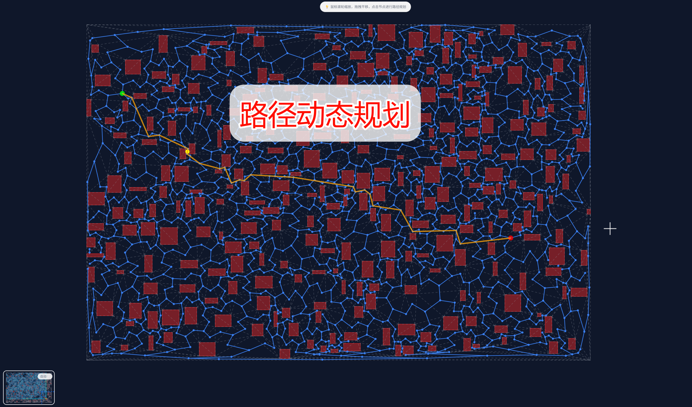

# RoadNet Visualizer

基于 Vite + PixiJS + Web Workers 的多层道路网络可视化工具，支持路径优化、导航控件、导出分享与主题化。

[](https://deepwiki.com/Duri686/RoadNetVisualizer)
  
## 功能特性
- 生成多层道路网络：质心网络、Portal 中点、Voronoi 骨架（实验）
- 路径优化：平滑与正交化，线条更顺更直，提供耗时统计
- 交互与导航：缩放、平移、节点选取、图层开关与画布导航控件
- 寻路与动画：A* 路径与动态小球动画
- 导出与分享：一键导出与分享结果
- 移动端适配：手机端操作更顺畅
- 性能与可观测性：索引构建、渲染初始化/总耗时、数据体积等指标
- 主题与样式：夜间/黑白主题，组件化样式体系

## 效果预览




## 本地开发
```bash
# 安装依赖（建议 Node.js 20+）
corepack enable
yarn install --immutable

# 启动开发
yarn dev

# 构建产物
yarn build
```

## 部署到 GitHub Pages
本仓库已提供 Actions 工作流：`.github/workflows/deploy.yml`
- 推送到 `main` 分支会自动构建并部署 `dist/` 到 Pages。
- 如需自定义基础路径，已在 `vite.config.js` 使用 `base: './'` 便于 Pages 子路径访问。

## 目录结构
```
src/
├── core/                # 渲染核心（渲染/视图/图层/交互/配置 + Workers）
├── core/interaction/    # 交互拆分模块（事件/管线/动画）
├── utils/               # 工具库（导航/几何/路径/索引/导出/分享/状态 等）
│   └── navigation/      # 导航子模块（质心/Portal/Voronoi/分区 等）
├── components/          # UI 组件（表单、进度、图层控制）
├── css/                 # 样式与主题（base/reset/tokens/utilities/layout/buttons/forms/...）
└── main.js              # 应用入口
```

## 许可证（License）
本项目以 **非商用许可证（Non-Commercial License）** 开源：
- 允许任何人查看、分叉（fork）、修改与学习代码；
- 允许在非商业目的下使用本项目及其派生作品；
- **禁止任何形式的商业使用**（含直接或间接盈利、售卖、付费服务、企业内部商用等）；
- 再分发时必须保留本声明及版权信息。

如需商业授权，请通过 Issue 与我们联系。

## 致谢
- [PixiJS](https://pixijs.com/)
- [d3-delaunay](https://github.com/d3/d3-delaunay)
- [Turf.js](https://turfjs.org/)
- Vite & GitHub Actions
