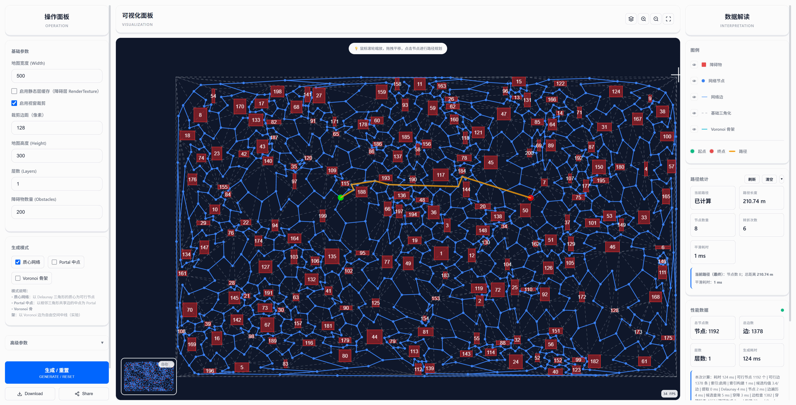

# RoadNet Visualizer

基于 Web 技术（Vite + PixiJS + Web Workers）的多层道路网络生成与可视化工具。支持路径优化（平滑/正交化）、多层导航、交互控制、导出分享与主题化。

[English README](./README.en.md)

[](https://deepwiki.com/Duri686/RoadNetVisualizer)


## 在线体验

- Demo（GitHub Pages）：[GitHub Pages Demo](https://duri686.github.io/RoadNetVisualizer/)
- 桌面与移动端均已适配，推荐使用最新版本 Chrome/Edge。

## 目录

- [功能特性](#功能特性)
- [效果预览](#效果预览)
- [快速上手](#快速上手)
  - [环境要求](#环境要求)
  - [本地开发](#本地开发)
  - [构建与部署](#构建与部署)
- [核心概念与架构](#核心概念与架构)
- [配置项（示例）](#配置项示例)
- [路线图（Roadmap）](#路线图roadmap)
- [贡献指南](#贡献指南)
- [FAQ](#faq)
- [许可证（License）](#许可证license)
- [致谢](#致谢)

## 功能特性

- 生成多层道路网络  
  质心网络、Portal 中点、Voronoi 骨架（实验）
- 路径规划与优化  
  A* 寻路；路径平滑与正交化；提供耗时统计
- 交互与导航  
  缩放、平移、节点选取、图层开关、画布导航控件
- 导出与分享  
  一键导出与分享结果
- 移动端适配  
  触控体验优化
- 性能与可观测性  
  索引构建、渲染初始化/总耗时、数据体积等指标
- 主题与样式  
  夜间/黑白主题，组件化样式体系
- 文档与帮助  
  接入 DeepWiki，便捷检索项目知识

## 效果预览




## 快速上手

### 环境要求

- Node.js >= 20
- 包管理：Yarn（通过 Corepack 启用）
- 浏览器：现代浏览器（Chrome/Edge 最新）

### 本地开发

```bash
corepack enable
yarn install --immutable

# 启动开发
yarn dev

# 构建产物
yarn build

# 本地预览（构建后）
yarn preview
```

### 构建与部署

- 已提供 Pages 工作流：`.github/workflows/deploy.yml`
- 推送到 `main` 分支会自动构建并部署 `dist/` 到 GitHub Pages
- Vite 基础路径已设置为 `base: './'`，便于子路径访问与 Pages 部署

## 核心概念与架构

- 多层网络构建  
  - 质心网络：基于区域/网格构建骨架节点  
  - Portal 中点：跨分区的连通桥接  
  - Voronoi 骨架（实验）：以 Voronoi 边/点辅助生成替代表达
- 路径规划与优化  
  - 寻路：A*  
  - 优化：平滑、正交化，使线条更“顺”和“直”  
  - 指标：寻路与优化阶段的耗时统计
- 渲染与交互  
  - 渲染：PixiJS（WebGL）  
  - 交互：缩放/平移、节点选取、图层开关、画布导航控件  
  - 动画：小球沿路径动态播放
- 并行与性能  
  - Web Workers：索引/计算在 Worker 中执行，降低主线程阻塞  
  - 可观测性：索引构建、渲染初始化、总耗时、数据体积

> 目录结构参考：

```text
src/
├── core/                # 渲染核心（渲染/视图/图层/交互/配置 + Workers）
├── core/interaction/    # 交互拆分模块（事件/管线/动画）
├── utils/               # 工具库（导航/几何/路径/索引/导出/分享/状态 等）
│   └── navigation/      # 导航子模块（质心/Portal/Voronoi/分区 等）
├── components/          # UI 组件（表单、进度、图层控制）
├── css/                 # 样式与主题（base/reset/tokens/utilities/layout/buttons/forms/...）
└── main.js              # 应用入口
```

## 配置项（示例）

- 部署：`vite.config.js` 使用 `base: './'`  
- 构建：`build.outDir = dist`，`build.sourcemap = true`  
- 开发：`server.port = 3000`，`server.open = true`  
- Worker：`worker.format = 'es'`  

> 如需公开更多运行时/算法级配置（例如：网格尺寸、权重、采样密度、平滑系数等），可在 `src/core/config/` 导出并在此补充说明。

## 路线图（Roadmap）

- [ ] 导入/导出更多数据格式（例如 GeoJSON）
- [ ] 更丰富的权重/约束（车道/转弯/禁行/成本函数）
- [ ] 路径优化策略增强（多目标/分段策略）
- [ ] 性能 Profiling 面板与指标面板可视化
- [ ] 单元测试与 E2E 测试覆盖
- [ ] 国际化（i18n）与可访问性（a11y）
- [ ] 更多主题与可视化样式

## 贡献指南

- 分支模型：feature/xxx -> 提交 PR 到 `main`
- 基本约定：Node 20 + Yarn、ESM、保持 ESLint/Prettier 通过
- 开发步骤：
  1. Fork 本仓库并创建分支
  2. `corepack enable && yarn install --immutable`
  3. `yarn dev` 开发并确保构建通过
  4. 发起 PR，描述修改动机与效果截图/对比

> 欢迎通过 Issue 反馈需求/缺陷/性能建议。

## FAQ

- Pages 打开空白页？  
  已设置 `base: './'`。若仍异常，建议清缓存或确认 Pages 分支/源码目录配置。
- Node 版本要求？  
  Node >= 20。建议使用官方 LTS，且通过 `corepack enable` 启用 Yarn。
- 本地预览地址？  
  默认 `http://localhost:3000/`（Vite server）。
- 性能不稳定？  
  推荐使用硬件加速的浏览器，确保 WebGL 可用；大数据时建议减小采样密度或分批加载。
- DeepWiki 没有显示？  
  请确认网络环境与扩展访问，或直接访问文档入口链接。

## 许可证（License）

本项目以「非商用许可证（Non-Commercial License）」开源：
- 允许查看、分叉、修改与学习；
- 允许在非商业目的下使用本项目及其派生作品；
- 禁止任何形式的商业使用（含直接/间接盈利、售卖、付费服务、企业内部商用等）；
- 再分发须保留本声明及版权信息。

如需商业授权，请通过 Issue 与我们联系。完整许可证请参见根目录 [LICENSE](./LICENSE)（PolyForm Noncommercial 1.0.0）。

## 致谢

- [PixiJS](https://pixijs.com/)
- [d3-delaunay](https://github.com/d3/d3-delaunay)
- [Turf.js](https://turfjs.org/)
- Vite & GitHub Actions

---
项目地址：[Duri686/RoadNetVisualizer](https://github.com/Duri686/RoadNetVisualizer)
