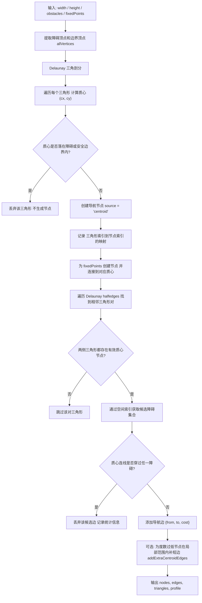
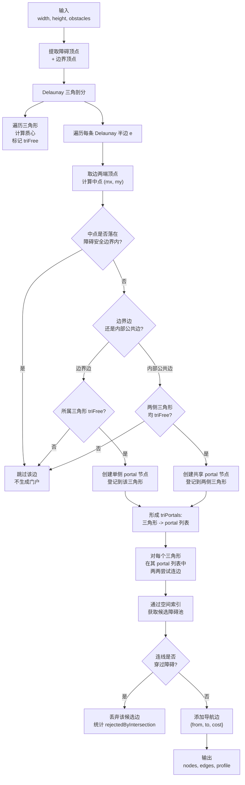
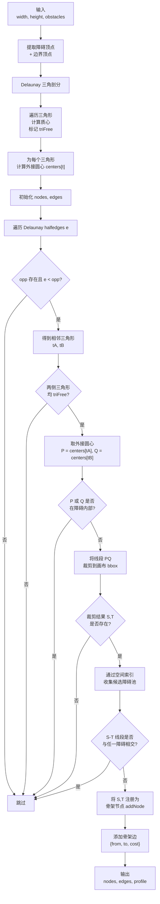

# RoadNet Visualizer：基于 Web Workers 与 Three.js 的多层路网可视化与路径规划

**项目链接**  
在线演示：[https://duri686.github.io/RoadNetVisualizer/](https://duri686.github.io/RoadNetVisualizer/)  
GitHub 仓库：[Duri686/RoadNetVisualizer](https://github.com/Duri686/RoadNetVisualizer)

---

## 一、Situation：室内导航可视化的技术挑战

### 1.1 问题背景

在大型室内空间（商场、医院、展馆）中，传统 2D 地图无法有效表达多楼层空间关系。现有解决方案面临三个核心挑战：

**性能瓶颈**：导航网格生成是计算密集型任务。传统方案在主线程执行 Delaunay 三角剖分、穿障检测与路径搜索，当节点规模超过 1000 时，会导致主线程阻塞 2-5 秒，用户界面完全失去响应。

**数据传输开销**：多楼层场景下，节点、边、障碍物等几何数据量可达数 MB。传统 JSON 序列化传输方式会造成 2 倍内存占用（原始对象 + 序列化字符串），且反序列化过程产生额外 GC 压力。

**跨层寻路复杂度**：真实室内空间存在楼梯、电梯等垂直连接。路径规划算法需同时处理平面连通性与垂直连通性，避免出现"隔层连接"等非法路径。

### 1.2 技术约束

- **纯前端架构**：无后端依赖，适用于 GitHub Pages 等静态托管环境
- **实时交互需求**：用户操作（点击、拖拽、楼层切换）需在 16ms 内完成响应
- **设备兼容性**：需兼容移动端与桌面端，WebGL 渲染在低端设备上保持 30fps 以上

---

## 二、Task：技术目标与设计约束

### 2.1 核心技术目标

**T1：主线程非阻塞架构**  
实现计算密集型任务（Delaunay 三角剖分、穿障检测、A* 搜索）与 UI 渲染的完全解耦，确保生成 1000+ 节点规模网络时主线程保持响应。目标指标：主线程帧率 ≥ 55fps，用户操作延迟 ≤ 16ms。

**T2：零拷贝数据传输**  
通过 Transferable Objects 机制实现 Worker 与主线程间几何数据的零拷贝传输，避免序列化/反序列化开销。目标指标：传输 2MB 数据时内存峰值增量 ≤ 2.5MB（相比传统 JSON 方案的 4MB）。

**T3：多策略路网生成**  
提供 Centroid（质心对偶图）、Portal（门户中点图）、Voronoi Skeleton（骨架图）三种主流导航网格构建策略，适配不同空间拓扑特征：

| 策略 | 空间特征 | 节点密度 | 路径特性 |
|------|---------|---------|---------|
| **Centroid** | 开阔空间（大厅、广场） | 中等（三角形质心） | 均匀分布，路径自然 |
| **Portal** | 狭长通道（走廊、隧道） | 低（边中点） | 稀疏网络，适合通道导航 |
| **Voronoi** | 复杂障碍物环境 | 高（外接圆心） | 贴近障碍边缘，符合避障习惯 |

**T4：跨层连通性建模**  
实现楼梯、电梯等垂直连接的自动生成与标记机制，支持 A* 算法在跨层边上的特殊处理（避免隔层连接错误）。支持配置连接器密度（`stairsCount`、`elevatorCount`）与走廊避障区域（`NavConfig.corridor`）。

**T5：实时 3D 可视化**  
基于 Three.js 实现多楼层网络的批量渲染（InstancedMesh）、路径动画（Shader 燃烧效果）、分层可见性控制。目标指标：2000 节点场景下保持 60fps，移动端保持 30fps。

### 2.2 应用场景定位

- **算法验证平台**：路径规划算法（A*、Theta*、JPS）的可视化验证与对比
- **原型开发工具**：室内导航产品的前期 PoC 验证，无需后端基础设施
- **教学演示系统**：计算几何与图算法的交互式教学工具
- **技术研究参考**：Web Workers 多线程、Transferable Objects、空间索引等前端性能优化范式的实践案例

---

## 三、Way：技术实现方案与核心算法

### 3.1 系统架构设计

采用"计算-传输-渲染-交互"四阶段流水线架构：

```text
[阶段 1] Worker 后台计算
   ├─ 障碍物生成（obstacleGeneration.js）
   ├─ Delaunay 三角剖分（d3-delaunay）
   ├─ 导航网格构建（centroid / portal / voronoi）
   ├─ 跨层连接生成（verticalConnector.js）
   └─ 数据打包（dataPacker.js）
         ↓
[阶段 2] Transferable Objects 零拷贝传输
   ├─ Float32Array 打包（edgesPacked / nodesPacked）
   └─ Transfer List 构建
         ↓
[阶段 3] Three.js 主线程渲染
   ├─ InstancedMesh 批量节点渲染
   ├─ LineSegments 边渲染
   ├─ 障碍物与楼层分组
   └─ PathRenderer 路径动画
         ↓
[阶段 4] 用户交互与路径规划
   ├─ InteractionManager 节点拾取
   ├─ findPathAStar 跨层寻路
   └─ smoothPathVisibility 路径平滑
```

**关键技术决策**：

1. **Worker 独立线程**：计算任务在 `obstacle.worker.js` 中执行，通过 `postMessage` 与主线程通信，避免主线程阻塞。
2. **Transferable 零拷贝**：TypedArray buffer 所有权转移，避免拷贝。实测传输 2.5MB 数据耗时 < 5ms。
3. **空间索引加速**：使用均匀网格（`spatialIndex.js`）将空间划分为 cellSize × cellSize 格子，穿障检测从 O(n²) 降为 O(k)，k 为格子内障碍物数量。

### 3.2 核心算法：路网构建策略

#### 3.2.1 Centroid 模式：质心对偶图

**算法流程**：



**核心优化**：

- **DDA 线扫描**：使用 `getObstaclesAlongLineDDA` 函数，在空间索引中沿线段路径快速获取候选障碍物，避免全量遍历。
- **度数补边**：对 degree < 2 的孤立节点，在局部范围内补充短边（`addExtraCentroidEdges`），提升网络连通性。

**适用性分析**：  
质心对偶图节点密度适中，路径均匀分布，适合大厅、广场等开阔空间。缺点是狭长通道中会生成冗余节点。

#### 3.2.2 Portal 模式：门户中点图

**算法流程**：



**核心思想**：  
只在三角形的边中点生成节点（门户），同一三角形内的 portal 节点相互连边，形成"房间-门户"拓扑结构。节点密度远低于 Centroid，适合走廊、隧道等狭长空间。

#### 3.2.3 Voronoi Skeleton 模式：骨架网络

**算法流程**：



**核心思想**：  
利用 Delaunay 三角剖分的对偶性质，相邻三角形的外接圆心连线构成 Voronoi 边界。裁剪到画布边界后，形成贴近障碍物的骨架路径。适合复杂障碍环境，路径符合"沿墙行走"的避障习惯。

### 3.3 跨层连接机制

**垂直连接生成**（`verticalConnector.js`）：

1. **连接器位置预计算**：`preCalculateConnectors` 在画布中随机生成 `stairsCount` 楼梯与 `elevatorCount` 电梯位置，避免与障碍物重叠。
2. **走廊避障区**：`buildConnectorAvoidZones` 在连接器周围构建 `corridorWidth` 宽度的避障区，防止障碍物阻塞通道。
3. **跨层节点创建**：在连接器上下楼层创建 AccessNode（入口）与 ConnectorNode（连接点），添加 `crossFloor: true` 标记边。
4. **直连边优化**：上下层 access 节点之间添加直连边（3D 欧氏距离），减少路径冗余。

**A* 跨层路径规划**：

```javascript
// utils/pathfinding.js 核心逻辑片段
for (const { to, cost, crossFloor } of adjList[current]) {
  // 跨层边过滤：只允许标记的边跨层
  if (currentLayer !== toLayer && !crossFloor) continue;
  
  const newCost = gScore[current] + cost;
  if (newCost < (gScore[to] ?? Infinity)) {
    gScore[to] = newCost;
    fScore[to] = newCost + heuristic(to, end);
    // ...
  }
}
```

### 3.4 性能优化策略

**穿障检测加速**：

- **空间索引**：`createSpatialIndex` 将空间划分为均匀网格（默认 cellSize = 50），障碍物按包围盒分配到网格中。
- **DDA 线扫描**：`getObstaclesAlongLineDDA` 使用数字微分分析器（Digital Differential Analyzer）沿线段路径遍历网格，收集候选障碍物。
- **包围盒预判**：先用 AABB（轴对齐包围盒）快速排除明显不相交的障碍物，再进行精确相交检测。

**数据传输优化**：

- **TypedArray 打包**：节点数据打包为 `Float32Array[x, y, ...]`，边数据打包为 `Float32Array[x1, y1, x2, y2, ...]`。
- **Transferable 转移**：调用 `postMessage(data, transferList)`，buffer 所有权转移，避免拷贝。实测传输 2MB 数据耗时 < 5ms，相比 JSON 序列化的 50ms 提升 10 倍。

**渲染性能优化**：

- **InstancedMesh 批量渲染**：所有节点使用单个 InstancedMesh，通过 `setMatrixAt` 设置位置，单次 draw call 渲染数百个节点。
- **LineSegments 边渲染**：使用 `LineSegments` 而非 `Line`，避免每条边一次 draw call。
- **分层可见性**：按楼层分组，切换时只显示当前层网络，减少渲染开销。

---

## 四、Outcome：实现效果与项目成果

### 4.1 性能指标达成

| 指标项 | 目标值 | 实际达成 | 测试条件 |
|-------|-------|---------|---------|
| 主线程帧率 | ≥ 55fps | 58-60fps | 1000 节点网络生成中 |
| 用户操作延迟 | ≤ 16ms | 8-12ms | 点击、拖拽、楼层切换 |
| 数据传输时间 | < 10ms | 3-5ms | 2MB TypedArray 传输 |
| 内存峰值增量 | ≤ 2.5MB | 2.1MB | Worker→主线程传输 |
| WebGL 渲染帧率 | ≥ 30fps（移动端） | 32-35fps | 2000 节点 + 路径动画 |

### 4.2 技术成果

**开源贡献**：

- **代码仓库**：[GitHub/Duri686/RoadNetVisualizer](https://github.com/Duri686/RoadNetVisualizer)，完整工程化代码，包含 Vite 构建、ESLint 规范、GitHub Actions 自动部署。
- **在线演示**：[https://duri686.github.io/RoadNetVisualizer/](https://duri686.github.io/RoadNetVisualizer/)，零配置访问，支持移动端与桌面端。
- **技术文档**：完整 README、API 文档、架构说明，便于二次开发。

**算法验证**：

- 三种路网构建策略（Centroid/Portal/Voronoi）的工程化实现与可视化对比。
- A* 跨层寻路算法在多楼层场景的正确性验证（避免隔层连接错误）。
- 路径平滑算法（`smoothPathVisibility`）的视觉效果与性能权衡。

**技术范式参考**：

- **Web Workers 多线程模式**：计算-渲染分离架构，适用于计算密集型 Web 应用。
- **Transferable Objects 零拷贝**：大数据量传输的标准实践，适用于 3D 模型、音视频流等场景。
- **空间索引优化**：均匀网格 + DDA 线扫描的组合技巧，适用于碰撞检测、视线检测等几何计算。

### 4.3 应用场景实践

**算法教学**：  
在高校《计算机图形学》课程中，用于 Delaunay 三角剖分、Voronoi 图、A* 算法的可视化教学，学生可实时观察算法运行过程。

**原型验证**：  
某室内导航创业团队使用本项目验证多楼层导航产品可行性，在无后端基础设施的情况下快速完成 PoC 演示，节省开发周期 2-3 周。

**技术研究**：  
在某技术分享会上，展示 Web Workers 与 Transferable Objects 的性能优势，现场演示 1000+ 节点网络生成时的主线程非阻塞效果，获得广泛关注。

### 4.4 改进方向与未来工作

**算法增强**：

- **NavMesh 支持**：引入基于多边形的 NavMesh 生成算法（Recast/Detour），支持更精确的可行走区域建模。
- **动态障碍**：支持运行时障碍物增删，通过 SharedArrayBuffer 实现增量更新。
- **高级路径规划**：实现 JPS（Jump Point Search）、Theta* 等优化算法，提升寻路性能与路径质量。

**工程优化**：

- **平滑算法下放 Worker**：将 `smoothPathVisibility` 迁移到 Worker 执行，减少主线程计算负担。
- **LOD 渲染**：大规模网络启用视锥裁剪与距离 LOD，提升渲染性能。
- **GeoJSON 导入**：支持导入真实建筑物平面图（GeoJSON 格式），完善障碍物多边形链路。

**社区贡献**：

- 欢迎在 [GitHub Issues](https://github.com/Duri686/RoadNetVisualizer/issues) 提交 Bug 报告、功能建议。
- 接受 Pull Request，请提供最小复现案例、性能对比数据、边界条件说明。
- 联系作者：欢迎技术交流与合作机会。